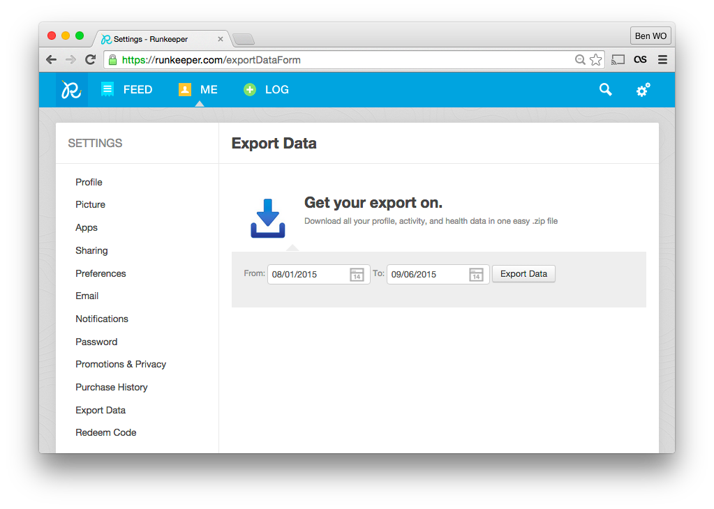
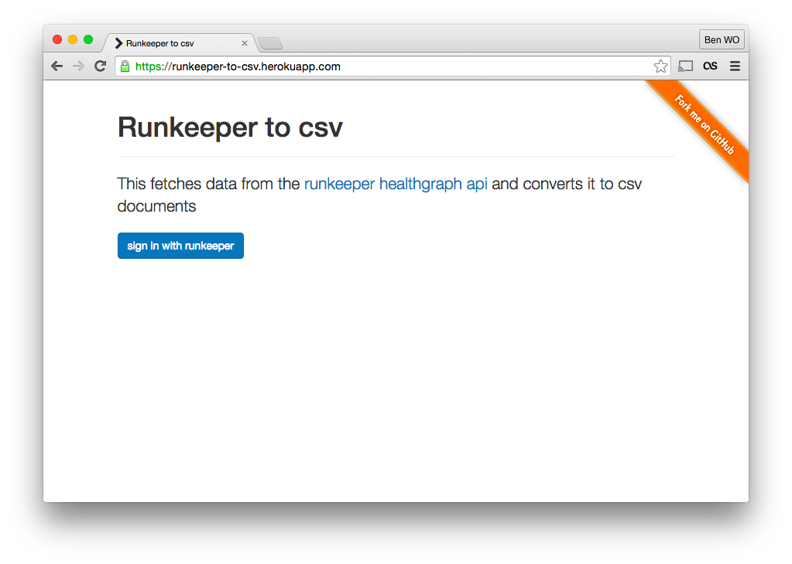
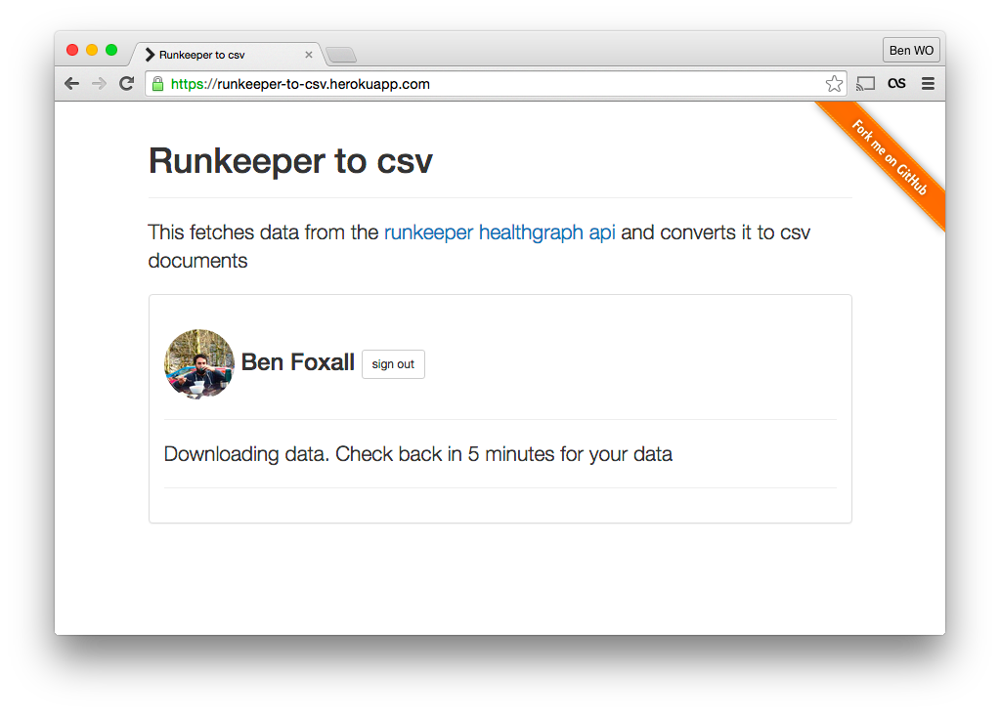
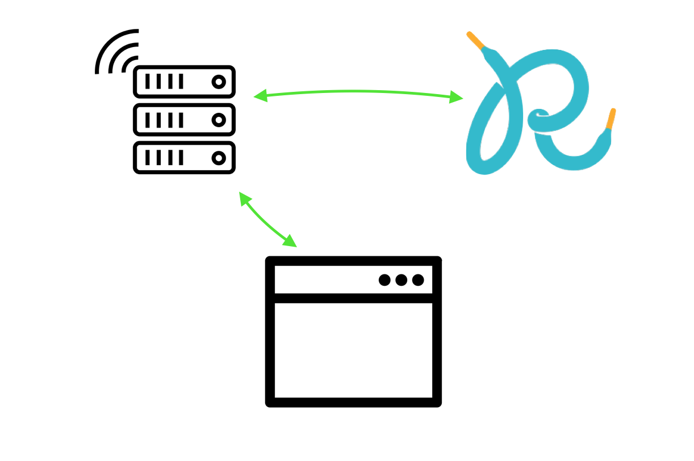
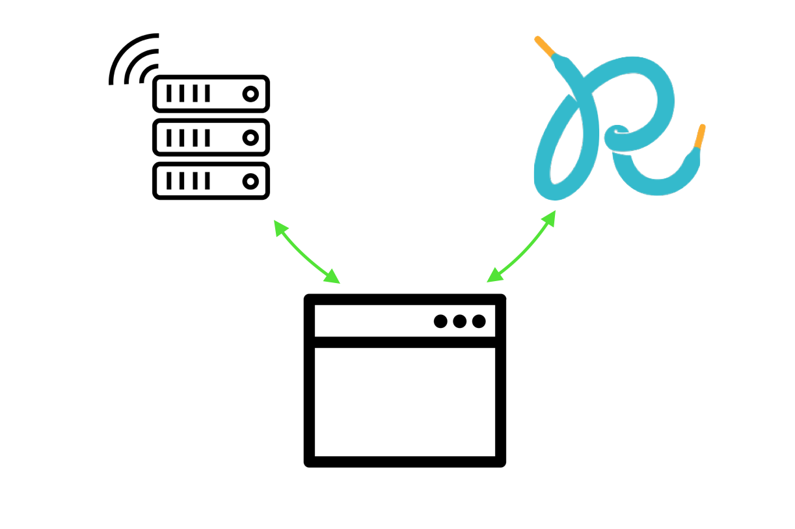
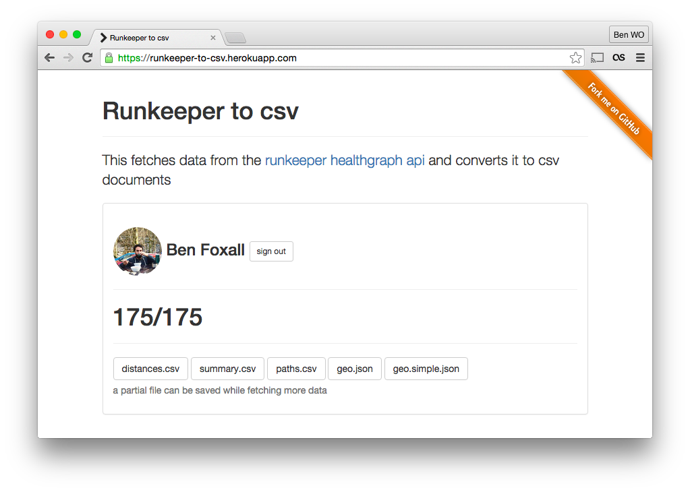
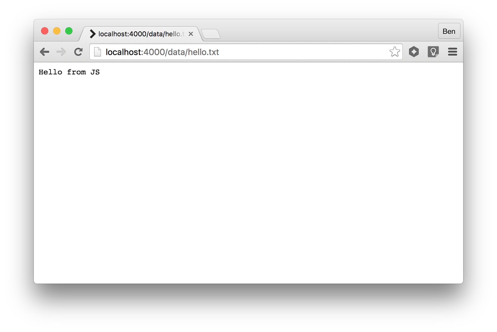
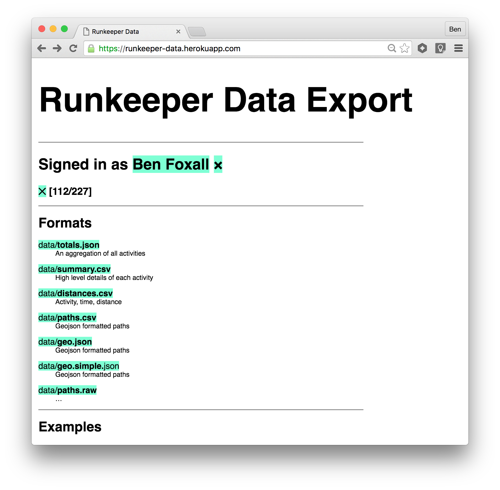

## [fit] Serving CSV from the Browser

### [fit] Ben Foxall,@benjaminbenben,@pusher


^
I like being first. I like the idea that if I'd got everything wrong, like I don't even know what csv *is* - then I'm fine for half an hour.

^
(maybe?) I usually talk about interactive demos and hacks, though this is going to be more useful.  You can tell, because I've picked a serif font for my slides.

---

# [fit] CSV

^
Yup!

---

# Things I really like about CSV:

* Accessibility - data for everyone
* It's the start of something, not the end

^
1. It's accessible - it allows such a wide range of people to get their hands on their data and do interesting things
2. It's the start, not the end - you're not like "I've got a csv file, job done", by giving someone that file there's an excitement about what they're going to do with it.

---

## The thing I’m going to talk about:

# [fit] Your data :arrow_right: :cloud:

## As a Person, I would like my data in a csv file, so that I can do some cool stuff with it

---

# :cloud:

* Runkeeper - _gps routes of running activities_

---

## How do we get our data back?

---

# Attempt 1

---

# Attempt 1
## Download it



—


—


—

# 👌

* Job Done

^
* We’ve got our data

—

# ❌

* No format control
* Functionality might change/disappear
* Need to go online to retrieve different times


^
* gpx + csv, perhaps we wanted lat/lng
* lastfm removed their downloading options in the newest rebrand


---

# Attempt 2

—

# Attempt 2
## Write a script

—


```bash
export BEARER=MY_TOKEN_FROM_THE_CONSOLE

curl https://api.runkeeper.com/fitnessActivities?pageSize=100        -H "Authorization: Bearer $BEARER" > page1.json
curl https://api.runkeeper.com/fitnessActivities?pageSize=100&page=2 -H "Authorization: Bearer $BEARER" > page2.json
curl https://api.runkeeper.com/fitnessActivities?pageSize=100&page=3 -H "Authorization: Bearer $BEARER" > page3.json
curl https://api.runkeeper.com/fitnessActivities?pageSize=100&page=4 -H "Authorization: Bearer $BEARER" > page4.json
curl https://api.runkeeper.com/fitnessActivities?pageSize=100&page=5 -H "Authorization: Bearer $BEARER" > page5.json

jq '.items' page*.json | grep uri | sed 's/^.*"\///g' | sed 's/"//g' > urls.txt

mkdir fitnessActivities

while read p; do
  curl https://api.runkeeper.com/$p -H "Authorization: Bearer $BEARER" > $p.json
done < urls.txt
```

—


—

# 👌

* format choices
* sharable
* offline

^
* you have the raw data, you can choose what it says
* Offline -> we’ve got the source data, so we can take different

—

# ❌

* Inaccessible

---

# Attempt 3

---

# Attempt 3
## Make a web service

—



—



—

# 👌

* Accessible

—

# ❌

* Non-trivial backend
* Handling sensitive data
* Processing queues
* Online only

---

# Attempt 4

---

# Attempt 4
## Go client-side

—




—



—



—

# 👌

* Accessible
* Data stored locally
* Available instantly


—

### What we’ll implement in the browser:

## Request ‣ Process ‣ Serve

---

# Request

—

## A small Runkeeper API

```js
const apiRequest = (path, token) =>
    fetch(`http://runkeeper.com/${path}`, {
        headers: {
            Authorisation: `Bearer: ${token}`
        }
    })
    .then(response => response.json())
```

^
Promise compositions with arrow functions are way cool - but not what we’re going to talk about today.

—


## A small Runkeeper API

```js
function apiRequest (path, token) {
    return fetch('http://runkeeper.com/' + path, {
        headers: {
            Authorisation: 'Bearer: ' + token
        }
    })
    .then(function(response) {return response.json()})
}
```

—

## dataForUser(…)

```js
const dataForUser => token => 
  apiRequest('/activityIndex', token)
    .then(extractUrls)
    .then(makeRequests)
```

^
it *is* a bit more complicated than that
We have to deal with rate limiting, errors, etc

—

# Process

—

## json :arrow_right: csv

—

## A few ways of doing this…

* [papaparse.com/docs#json-to-csv](http://papaparse.com/docs#json-to-csv)
* [csv-formatter](https://www.npmjs.com/package/csv-formatter)
* [jwerle/to-csv](https://github.com/jwerle/to-csv)

—

## …another way

```js
// pull out a row of keys
const row = (keys, obj) =>
  keys.map(k => obj[k])

// create a csv row from an array
const csv = array =>
  array.map(item =>
    typeof item === 'string'
        ? item.replace(/[\",]/g,'')
        : item
  ).join(',') + "\n"
```
  

^
This isn’t great, but it does the job (badly)

^
the just strips out “


—

```js
const keys = ['distance', 'climb', '…']

const csvForUser = (token) => 
  dataForUser(token)
    .then(pages => 
      pages.map(page => 
        csv(row(keys, page))
      ).join('\n')
    )
```

—

# Serve

^ We’ve got a string of csv, now what?

—

## Data URIs

---

# [fit] `data:[<mediatype>][;base64],<data>`

---

# [fit] `data:text/html,<h1>Hello World`

---

# [fit] `data:text/csv,a,b,c%0A1,2,3`

---


## Put it all together

```js
csvForUser(token)
  .then(csv => 
    document.querySelector('#csv-link').href = toDataURI(csv, 'text/csv')
  )
```

—

# :ship:

—

## … supporting bigger files

```js
  .then(csv => 
    … toDataURI(csv, 'text/csv')
  )
```

—-

# [fit] `Blob(blobParts[, options])`

^
IE 10, Others way back

—

## Blob

```js
const csvForUser = (token) => 
  dataForUser(token)
    .then(pages => 
      pages.map(page => 
        page.items.map(to_csv).join('')
      ).join('\n')
```

^
Different example, maybe many items per page

—

## Blobb

```js
const csvForUser = (token) => 
  dataForUser(token)
    .then(pages => 
      pages.map(page => 
        new Blob(page.items.map(to_csv))
      )
```

—

## Blobbb

```js
csvForUser(token)
  .then(csv => 
    document.querySelector('#csv-link').href = toDataURI(csv, 'text/csv')
  )
```

—

## Blobbbb

```js
csvForUser(token)
  .then(blobs => 
    const csv = new Blob(blobs,  {type: 'text/csv'})
    
    document.querySelector('#csv-link').href = URL.createObjectURL(csv)
    
    // "blob:https%3A//example.com/8ffbb9df-...-4fffe9160979"
  )
```

—

# [:ship:](http://benjaminbenben.com/lastfm-to-csv/)

^
this will be really useful to people

—

## …losing data

```js

```

—

## IndexedDB

—

## IndexedDB (with Dexie)

```js
const db = new Dexie('Runkeeper')
db.version(1).stores({
  activities: '&uri'
})
db.open()


fetch(uri)
  .then(res => res.json() )
  .then(data => db.activities.put(data))
```

—

## IndexedDB (with Dexie)

```
db.activities
  .each(activityToCSV)
```


—

# :ship:

—-

## …losing urls

> The `URL.createObjectURL()` static method creates a DOMString containing an URL representing the object given in parameter. The URL **lifetime is tied to the document in the window** on which it was created. The new object URL represents the specified File object or Blob object.

——

## Service Workers

—


#### (source: [MDN](https://developer.mozilla.org/en-US/docs/Web/API/Service_Worker_API/Using_Service_Workers))


—

## Service Workers

```js
self.addEventListener('fetch', event =>
  if(event.request.url.match(/data\/hello\.txt$/))
    event.respondWith(
      new Response('Hello from JS', 
        {ContentType: 'text/plain'}
      )
    )
```


—

## Service Workers




—

## Put it all together

```js
new Response(blob, {ContentType: 'text/csv'})
```

—

## Win

```js
self.addEventListener('fetch', event =>  {

    if(event.request.url.match(/data\/summary\.csv$/))
      respond(event, summaryResponse)

    if(event.request.url.match(/data\/distances\.csv$/))
      respond(event, distancesResponse)

    if(event.request.url.match(/data\/paths\.csv$/))
      respond(event, pathsResponse)

    if(event.request.url.match(/data\/geo\.json$/))
      respond(event, geoJSONResponse)

    if(event.request.url.match(/data\/geo\.simple\.json$/))
      respond(event, geoJSONResponseSimple)

    if(event.request.url.match(/data\/binary\.path\.b$/))
      respond(event, binaryPathResponse)

})
```

—

# [:ship:](https://runkeeper-data.herokuapp.com/)

—



—

# Danke schön

## @benjaminbenben

### Developer Relations at @pusher


#### <sub>_Network + Browser icons: YuguDesign & Fritz - [Noun Project](https://thenounproject.com)_</sub>